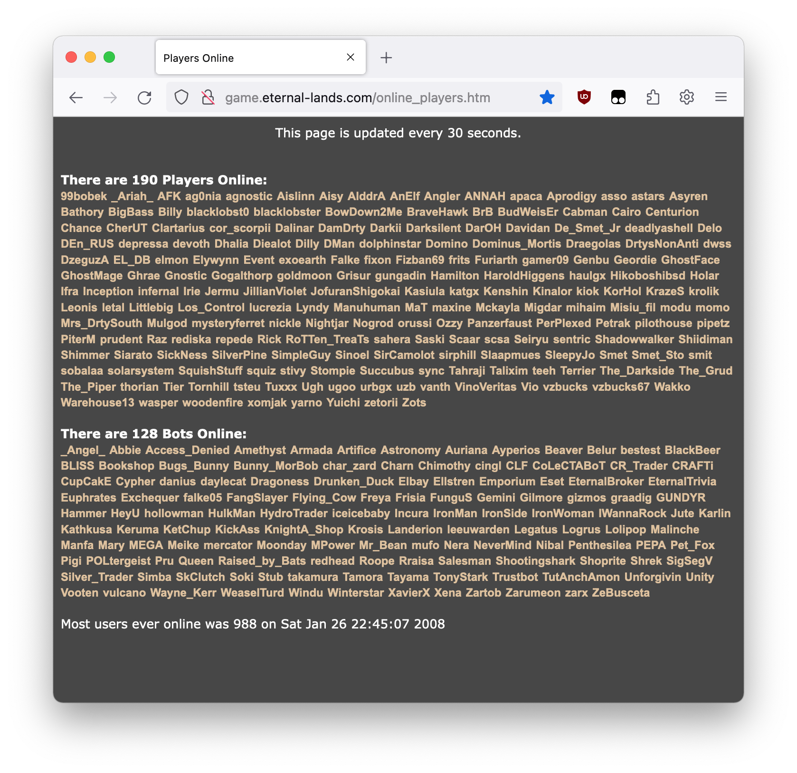
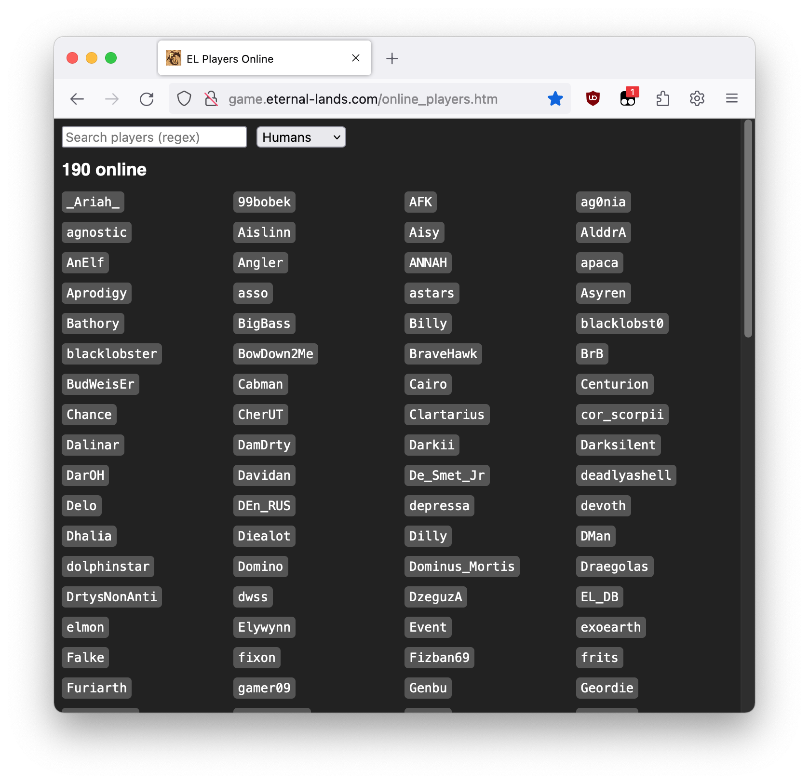

# userscripts

My userscripts for various websites.

They _should_ work with most userscript managers and modern browsers, but I've only actually tested them with Tampermonkey in latest Chrome and Firefox.

## Players Online enhancer

Makes the [Players Online](http://game.eternal-lands.com/online_players.htm) page a bit easier to read and adds search functionality.

Before:

After:

