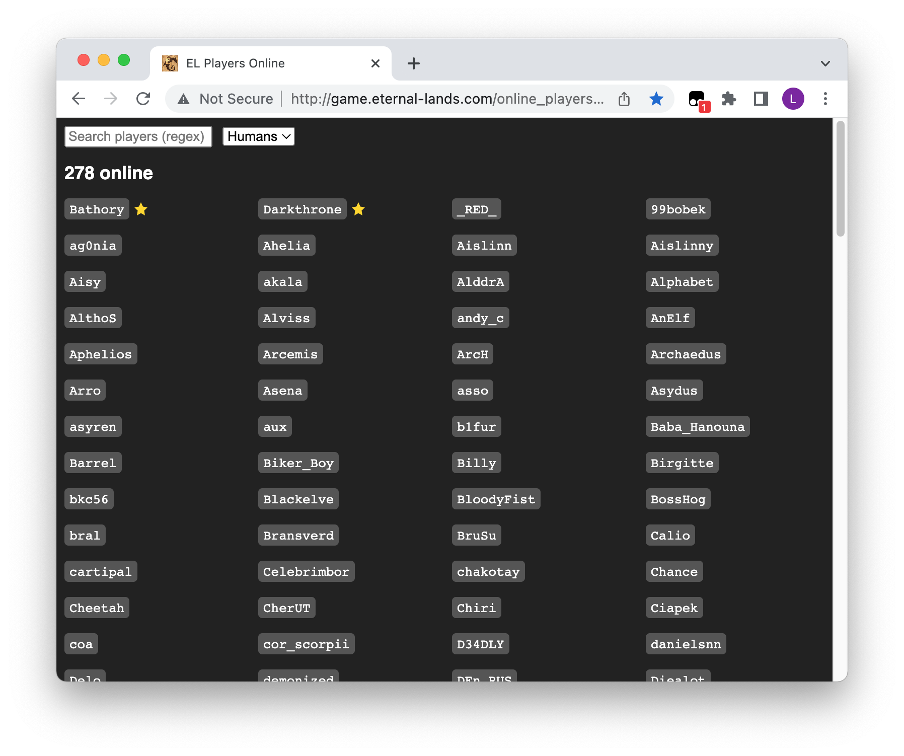
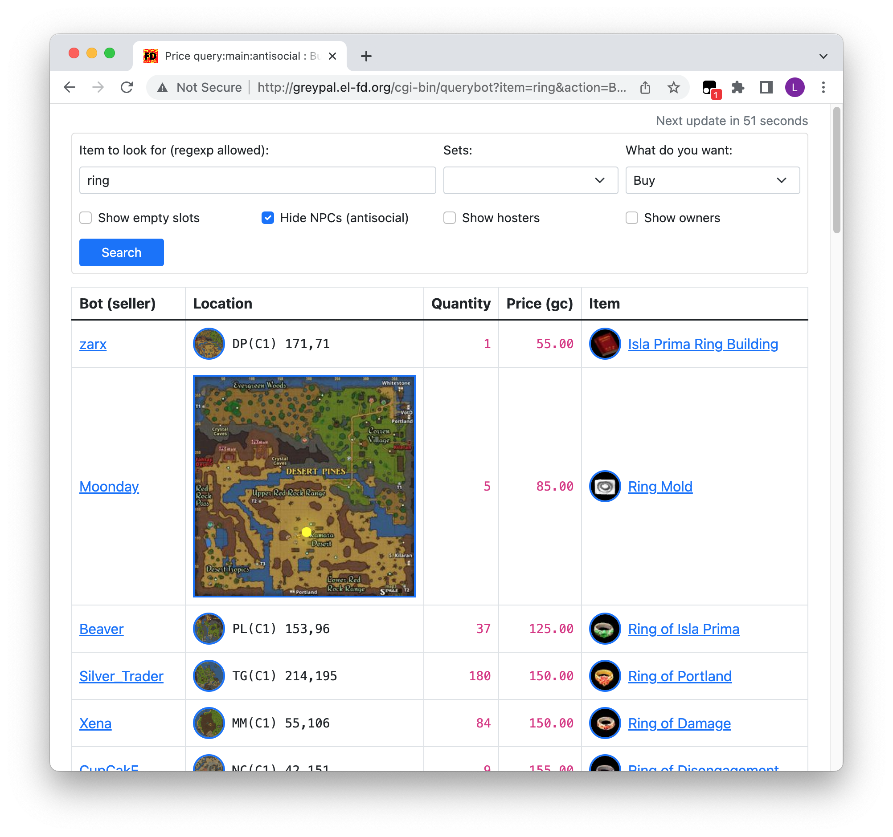

# el-userscripts

My userscripts for [Eternal Lands](http://www.eternal-lands.com).

They _should_ work with most userscript managers and modern browsers, but I've only actually tested them with Tampermonkey in latest Chrome and Firefox.

## Players Online enhancer

Makes the [Players Online page](http://game.eternal-lands.com/online_players.htm) easier to read and adds search functionality.

## Greypal Querybot enhancer

Makes Greypal's awesome [Querybot page](http://greypal.el-fd.org/cgi-bin/querybot) look a bit nicer.

